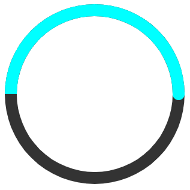

# JsInputModuls

js module adding a circular indicator.

---
* [Install](#Install)
* [Usage](#Usage)
  * [Base](#Base)
  * [Advanced](#Advanced)
  * [Examples](#Examples)
---

<a id="Install"></a>

## Install

```bash
npm i jsinputmoduls
```

---

<a id="Usage"></a>

## Usage

<a id="Base"></a>

### Base
```javascript
import {circleInput} from 'JsModuls' // import library
const test = document.getElementById("test-div") // getting the dom-element. 
const circle = circleInput(test, 300, 300)
```
* the first argument is the container where the component will be placed.
* the second argument is the width of the component.
* the third argument is the height of the component.

<a id="line"></a>

### Line
The returned object has a getLine method.

```javascript
const line1 = circle.getLine(0)
```
The method takes a line number and returns an object.
The line object has fields:
* color - accepts a string as a hexadecimal color code.
* value - accepts a number, by default from 0 to 100.
```javascript
line1.color = "#00f"
line1.value = 70
```
#### Methods linc

A link method that accepts a function to which it passes the indicator value. works with [type="range"](#type).
```javascript
line1.linc((data)=>{
  
})
```
### Example

```javascript
import {circleInput} from 'JsModuls'

const test = document.getElementById("test-div")
const circle = circleInput(test, 300, 300)

const line1 = circle.getLine(0)
line1.value = 50
line1.color = "#0ff"
```


---

<a id="Advanced"></a>

### Advanced
The function __circleInput__ takes an object as the fourth parameter.
```javascript
const circle = circleInput(test, 300, 300,{})
```
object fields:
* [margin](#margin)
* [padding](#padding)
* [x, y](#cords)
* [circles](#circles)
<a id="margin"></a>

#### margin
margin is the distance in pixels from the circle's border to the container's border.

<a id="padding"></a>

#### padding
padding is the distance in pixels between the circles.

<a id="cords"></a>

#### x, y
the x, y parameters define the center of the circle relative to the container's borders.

<a id="circles"></a>

#### circles
circles - accepts an array of objects. each object is a circle and has the following fields:
* [type](#type)
* [style](#style)
* [min, max](#minmax)
* [radius](#radius)
* [backCircle](#elements)
* [indicator](#elements)
* [point](#elements)

<a id="type"></a>

##### type
if you pass the string "range" to this argument, then the indicator can be moved as an input[type=range].
the [line object](#line) has a link method that works in this mode.

###### Example
```javascript
const circle = circleInput(test, 300, 300,{circles:[
  {
    type:"range"
  }
]})
```

<a id="style"></a>

##### style
the style field has 3 values.

| circle | semicircle | brokenСircle |
|--------|------------|--------------|
||||

###### Example for brokencircle
```javascript
const circle = circleInput(test, 300, 300,{circles:[
  {
    style: "brokenСircle"
  }
]})
```

<a id="minmax"></a>

##### Min, Max

set the maximum and minimum values.

```javascript
const circle = circleInput(test, 300, 300,{circles:[
  {
    max: 100,
    min: -100
  }
]})
```
<a id="radius"></a>

##### Radius

sets the radius.
```javascript
const circle = circleInput(test, 300, 300,{circles:[
  {
    radius: 50
  }
]})
```


<a id="elements"></a>

### backCircle, indicator, point

backCircle - sets the back line.
indicator - sets the fill line.
point - sets the point at the start of the fill line.

These objects have the following fields:
* color
* width - width line
* delete - if set to "true" removes the element.

---

<a id="Examples"></a>

### Examples


```javascript
const circle = circleInput(test, 300, 300,{circles:[
  {
    type: "range",
    indicator: {
      color: "#0fa"
    },
    point: {
      color: "#ff0"
    },
    backCircle: {
      width: 10
    }
  }
]})
```


---

```javascript
const circle = circleInput(test, 300, 300,{circles:[
  {
    type: "range",
    indicator: {
      delete: true
    },
    point: {
      color: "#ff0",
      width: 30
    },
    backCircle: {
      color: "#aaa"
    }
  }
]})
```


---

```javascript
const circle = circleInput(test,400,300,{margin: 5, padding:30, circles:[
  {
    type:"range",
    style: "brokenСircle",
    min:0,
    max:140,
    backCircle:{
      color: "#456",
      width: 20
    },
    indicator:{
      color:"#098",
      width:20
    },
    point:{
      color:"#ff0",
      width:30,
    }
  }
  ,{
    type:"indicator",
    style: "circle",
    min:0,
    max:200,
    indicator:{
      color:"#008",
      width:20
    },
    point:{
      color:"#0ff"
    }
  }
]})
```
